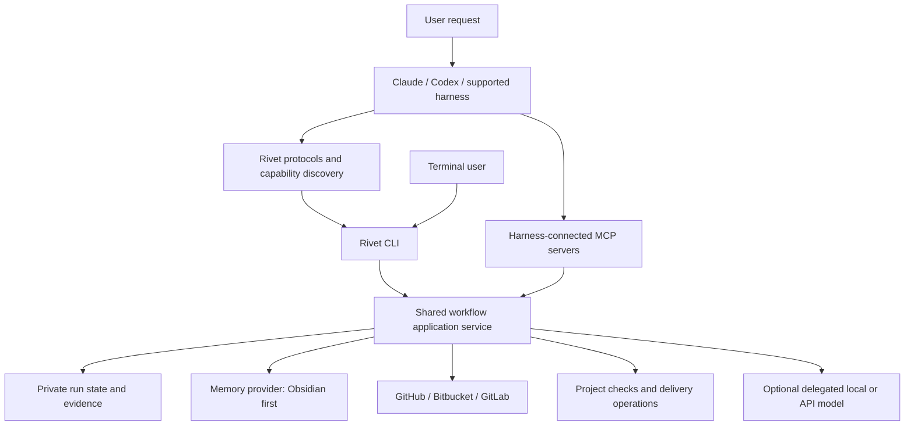

# Rivet Framework Implementation Plan

> **For Claude:** REQUIRED SUB-SKILL: Use superpowers:executing-plans to implement this plan task-by-task.

**Goal:** Build Rivet as a completely separate public Agilno project, using a reviewed source import from AI Engineering v2, that teams can install easily, operate through their preferred coding harness or CLI, connect to their tools, and use with shared project memory and multiple LLM providers.

**Architecture:** One workflow application service, exposed through a small CLI and thin harness instructions. The active coding harness can perform work through that service; standalone CLI usage can delegate execution to an installed harness. Replaceable memory, tool, source-control, and model adapters provide capabilities without making every integration mandatory.

**Tech Stack:** Reuse the current Node.js ESM CLI, JSON Schema/Ajv validation, YAML configuration, Git worktrees, and Node test runner. Add an Obsidian-compatible Markdown memory provider, harness-aware MCP integration, repository-provider adapters, and a Markdown documentation site built with a stable VitePress release and hosted on GitHub Pages.

**Status:** Implementation authorized. Rivet will initially be public under Frane's personal GitHub account, then transferred to the agreed organization. The selected public repository is `https://github.com/FraneAgilno/rivet` (default branch `main`). License and final package namespace remain pending. The September 22 priority is a usable MVP plus a simple Pages quickstart; expanded capabilities follow incrementally. Rivet is a new repository/package, not a rename, branch, compatibility release, or worktree of AI Engineering. Implementation begins in a separate local Git repository before the public destination is created.

---

## 1. Product direction and requirements

Petar's direction is the product brief. Rivet should be an opinionated framework for team delivery, with shared memory, integrations, evaluations, and model flexibility. The initial release may be smaller, but must preserve that direction.

Frane's interaction requirement is the existing team workflow pattern: a person speaks to Claude, Codex, or another capable harness; the agent discovers the process and invokes the framework CLI. The person can also invoke the CLI directly. Supporting this does not require starting a second model process every time an agent calls Rivet.

| ID | Requirement | Observable acceptance |
| --- | --- | --- |
| R1 | Simple global or project installation | One documented install command for either scope; no source checkout, build, jq, hand-written wrapper, or manual executable exports in the ordinary path |
| R2 | Harness-independent operation | The same task can be started conversationally through supported harnesses, initially tested with Claude/Codex plus a generic CLI/instruction integration; no mandatory slash commands or nested agent execution |
| R3 | Direct CLI access | A terminal user can initiate, inspect, resume, and finish the same workflow with understandable output |
| R4 | Shared memory with Obsidian support | A second collaborator retrieves a decision recorded by the first, with provenance and project isolation, outside the application repository |
| R5 | Replaceable integrations/MCPs | Teams select their providers; custom servers can be registered without changing workflow logic; capabilities and limitations are visible |
| R6 | Real Jira/Linear intake | Retrieve a ticket and criteria with source identity; inaccessible or incomplete input is explained rather than invented |
| R7 | Figma and knowledge context | Relevant design and documentation references can be captured and traced through implementation |
| R8 | GitHub, Bitbucket, GitLab | Repository work, review requests, checks, reviews, and authorized delivery use a common workflow with provider-specific implementations |
| R9 | Multiple LLM providers from the foundation | Provider/profile registration is extensible from the first implementation batch; hosted APIs, local models, and coding harnesses are distinct adapter kinds, with configurable model IDs and explicit tested capabilities |
| R10 | Proper distribution and docs | Public GitHub repository (initially Frane’s account, later organization transfer), maintained README, searchable Pages documentation, contributor guide, package/release process |
| R11 | End-to-end process and evals | Requirements, implementation, verification, review, authorized delivery, and memory handoff are demonstrable; regressions and onboarding are measured |
| R12 | Independent Agilno implementation | Reuse general concepts from existing team workflow without transferring client source code, private protocols, data, credentials, or client-specific artifacts |
| R13 | Project-specific protocols | A user or active harness can add/import a project procedure through the CLI; after validation and the project's review process, both Claude and Codex discover and use it |
| R14 | Completely separate product | Rivet has its own Git history, package, executable, configuration, state, CI/docs/releases, and provider contracts; it neither imports the AI Engineering package at runtime nor modifies its installation |

The framework's own documentation belongs with its source code. A customer's accumulated development memory belongs in the configured memory system. These are different categories.

## 2. Starting point and evidence

Inspected source: `codex/agentic-workflow-v2` at `af5753b4f9fe10e2a08cbe6e17c19e1ea6681704`.

Source worktree: `<local-checkout>`. It was clean when inspected. This planning document was originally stored in the AI Engineering checkout for review; copy the updated plan into the independent Rivet repository as its canonical implementation plan. Import selected tracked source from the v2 commit, not the older main tree. Do not share Git metadata/object storage, remotes, active state, or dependencies with AI Engineering. Existing untracked `output/` content is unrelated and must not be included. The temporary `codex/rivet-foundation` AI Engineering worktree created before this clarification is not the Rivet implementation repository.

| Area | Reuse | Gap |
| --- | --- | --- |
| Installation | `src/commands/install.js`, `uninstall.js`; global/project Claude/Codex skills | Multiple setup steps, mixed legacy/v2 paths, missing guided first-task experience |
| Workflow | `src/feature/workflow.js`, `runtime-bridge.js`, run store and commands | Current feature path launches its selected client; needs an active-harness execution option |
| CLI | `src/cli/main.js`, `parse-args.js`, `output.js` | Human interface exposes internal versions, digests, paths, and recovery mechanics |
| Client adapters | `src/clients/claude.js`, `codex.js`, `process-runner.js` | Exact version pins; same selected client per feature run; no general mixed-model support |
| Trackers | Jira/Linear adapters and `src/adapters/factory.js` | Live wiring exists; simplify onboarding and verify real account access |
| Other providers | Figma, Confluence, GitHub modules | Module existence is not evidence of full CLI/MCP composition or live compatibility |
| Isolation and verification | Worktrees, reservations, reducer, evidence, quality runner | Preserve correctness while improving visibility and normal recovery |
| Memory | Private local execution state | No shared team knowledge provider equivalent to the requested memory system |
| Docs | `docs/v2/*`, team docs, old PDF guides | Several generations of instructions; repository migration and user-focused docs needed |

The PDFs document an earlier rehearsal, including requirements to create disposable repositories and local origins. They are historical evidence, not installation requirements for the product. The diagram is the intended delivery lifecycle; the existing feature CLI stops at `awaiting-final-approval` and executes one worker at a time. Do not advertise the entire diagram as implemented today.

No new live model, tracker, memory, or delivery run was performed for this plan. Existing test files and documentation were inspected; tests were not rerun as proof of current readiness.

## 3. Architectural decisions

### 3.1 Keep one service and two ways to operate it

The requirement is repeatable team behavior, durable context, and verifiable outcomes. A CLI is an implementation choice. Coding harnesses can already read instructions, call MCPs, run commands, and coordinate work; Rivet must justify additional runtime code by a concrete need for reusable operations or state that must remain consistent across sessions and harnesses.

For each proposed command, first check whether a protocol plus a native harness tool or existing project script is sufficient. Keep that solution when it is. Add runtime code for reusable configuration/discovery, validated workflow transitions, memory/provider normalization, recovery, and independently checked evidence where those mechanics are actually needed. Do not recreate native editing, terminal, browser, or subagent functionality simply to put it behind a Rivet command.

Considered approaches:

1. **Evolve the existing service, with thin harness integration — selected.** Preserves valuable workflow/state/verification code and satisfies both conversational and terminal use.
2. Instructions-only distribution. Smaller package, but does not fulfill the agreed shared state, connectors, delivery, and memory requirements on its own.
3. A new hosted orchestration platform. Potential future direction, but introduces hosting, accounts, and operations before installation and workflow usability are solved.



The MCP-to-service arrow means validated source snapshots or operation observations supplied by the harness. It is not an assumption that the CLI can access a desktop application's private MCP connection or credentials.

### 3.2 Active-harness execution

Install short, discoverable entry instructions and reusable protocols. Claude/Codex should select the relevant workflow from ordinary user wording. Installers must state when a session restart/reload is required. Automatic discovery is tested for each supported harness, not promised for every AI application.

Expose service operations for preparing work, requesting the next bounded action, submitting a result, running checks, and reading status. The host agent performs the action with its existing tools in the assigned worktree. Rivet validates the resulting paths, source revision, and evidence before changing workflow state.

Keep graph roles as internal coordination concepts. A small fix should not require the user to configure a Boss and several Managers. Larger work can use the existing hierarchy when useful. Parallel scheduling is not enabled until its integration/conflict behavior is tested.

Standalone CLI orchestration can use the existing spawned-client path behind the same service. It is a separate launch mode, not a second implementation of the workflow.

#### Project-specific protocol authoring

Provide `rivet protocols add <name>` for creating a project protocol, with `--from <file>` to import an existing Markdown procedure. The terminal command scaffolds the document and gathers missing metadata; when used through a harness, the agent drafts the procedure from the user's request and passes it through the same CLI. Creating a protocol must not require a second model process.

For example: “Add a protocol saying database changes need a migration, rollback instructions, and an integration test.” The agent drafts those requirements, validates the protocol, and follows the project's normal review process before activating it. It does not invent additional team policy or silently commit/push the file.

Store project-owned procedures in `.rivet/protocols/<slug>.md`, separate from installed framework protocols. These files are portable project configuration intended for team review/version control, not accumulated work-history memory. Include a stable ID, title, purpose, applicability/triggers, draft/active/retired status, owner, procedure, required checks/evidence, and revision. Build the discovery index from these documents rather than maintaining a second authoritative copy.

`rivet protocols validate`, `find`, and `show` cover validation and discovery; `rivet protocols update <id>` prepares a revision without overwriting unrelated instructions. Existing IDs cause an explicit conflict on add. Validate imported paths and content before writing; an import copies an explicitly selected document rather than executing its instructions. Project procedures may extend framework defaults, but conflicting requirements must be surfaced and cannot silently expand an already approved run's authority.

Once active, a protocol becomes discoverable through both harnesses' existing Rivet entry points without reinstalling the framework. Load relevant procedures on demand and record the selected protocol revisions in the run; a mid-run edit requires reconciliation rather than silently changing the agreed procedure.

### 3.3 MCP and direct providers

Use MCPs already connected to the active harness where available. Rivet's protocols describe the needed capability, not one hardcoded tool name. Support explicitly configured direct API/CLI adapters when a standalone invocation needs the same operation.

Do not build an OAuth broker or universal MCP proxy for the first release. A standalone workflow with only a harness-connected integration must select that harness or request a direct connection; it must not pretend to inherit the connection. If later adding a direct MCP client, use a maintained SDK and a separately tested authentication path.

Normalize sources into `{provider, resourceId, url, revision, capturedAt, contentDigest, transport, assurance}`. Harness observations are labelled as such. They are not elevated to independent provider verification. Required external delivery evidence must be re-read from the provider through a supported path.

Track integration status separately: configured, reachable, authenticated, capability available, live tested. Registration of a custom MCP server means configurable access, not automatic compatibility with every workflow.

### 3.4 Independent identity and configuration

Use the `rivet` executable, `.rivet` project configuration, Rivet-owned private state, and `RIVET_*` environment variables from the first release. Do not retain an `ai-engineering` executable alias, automatically read its configuration/state, use its private registry, or overwrite its installed skills. Rename installed skill identifiers where necessary so both products can coexist. Keep shared Agilno authorship/provenance where appropriate; review transferred source for public distribution.

Global install supplies the shared executable and harness entry instructions. Project onboarding selects repository rules and providers. Machine-specific paths, credentials, and personal preferences stay in private user configuration; the product repository holds only portable policy and provider references. Existing four-file loaders must be migrated deliberately, not bypassed by writing a fifth config file they cannot load.

Project policy controls repository authority; global preferences cannot silently weaken it. Per-run overrides are explicit and recorded. No import rewrites or deletes existing AI Engineering private runs. An explicit user-requested configuration importer can be a later feature; implicit backward compatibility is not required.

### 3.5 Shared memory

Define a provider contract: health, search, read, append a record, supersede a record, and report sync status. A record contains a stable ID, project/team scope, category, author, timestamp, source links, revision, and verification status.

Start with a dedicated Obsidian vault outside the application repository. Prefer separate records for decisions, lessons, and handoffs over concurrent edits to one central document. Build retrieval from ordinary Markdown; a local rebuildable index is optional. Embeddings or a graph database are not required for the first useful integration.

Separate personal scratch data, shared project knowledge, and private execution state. Shared knowledge does not grant approval or replace current repository policy. Reports distinguish recorded locally, waiting to sync, shared, and conflicted. Retrying a write must not create duplicate records.

Team sync is part of acceptance: test two actual collaborators/devices. Use one chosen Obsidian sync mechanism per device and preserve conflicting records for resolution. Do not claim distributed locking or atomic multi-user updates from filesystem locking.

**Capacity constraint:** Obsidian currently documents a maximum of 20 collaborators per shared vault, active Sync subscriptions, and no fine-grained collaborator permissions. That is a supported small-team profile, not a solution for every 50-person company. Keep Obsidian supported; before onboarding a team beyond those limits, deliver another shared-memory provider (candidate: Notion or a team database/service), chosen against that team's requirements. This is an explicit release boundary, not an argument to remove memory. [Obsidian collaboration](https://obsidian.md/help/sync/collaborate).

Headless Sync is available in open beta and requires a Sync subscription. Evaluate it in the integration spike; desktop sync remains an option. The selected path must not run desktop and headless sync simultaneously on the same device. [Headless Sync](https://obsidian.md/help/sync/headless).

### 3.6 Source-control and delivery

Separate Git operations from hosting-provider operations. Local branches/worktrees use Git; repositories, pull/merge requests, reviews, CI results, and delivery use a provider interface.

Start with GitHub.com, Bitbucket Cloud, and GitLab.com. Self-hosted editions/custom endpoints require a compatibility exercise before being labelled supported. Detect ambiguous remotes and ask once during onboarding; never assume `origin` is the correct publishing target.

All three providers must pass the same acceptance suite for inspect repository, create/read/update review request, read checks/reviews, and authorized merge. Include draft/review-state differences in adapter behavior. A provider lacking a required capability returns an explicit unsupported result.

Repository delivery and application deployment are separate operations. Start deployment support with a project-declared CI/deployment command and a verifiable result URL/status. Test one actual configured deployment path before advertising it. Do not build every cloud deployment integration for release one.

### 3.7 Model flexibility

Three capabilities must remain distinct:

1. An existing coding harness operates Rivet: validate Claude, Codex, and a generic instruction/CLI path, without hardcoding the workflow to their provider names.
2. Terminal Rivet launches an installed harness: reuse existing clients after compatibility improvements.
3. An agent delegates a bounded task to a different local/API model: implement the provider/profile contract in the first batch, then qualify real executors before the wider release.

Model configuration belongs to profiles with supported tasks/tools, context limits, timeout, cost/token limits, and authentication references. The initial provider roadmap includes Anthropic API, OpenAI API, Google Gemini API, Ollama, and configurable OpenAI-compatible endpoints, in addition to local harness adapters. Model IDs and endpoints are configuration, not a closed enum of Claude/Codex model names. Distinguish available configuration profiles from implemented transports and live-qualified execution. Begin with a validated registry and shared API contract, then implement/qualify hosted and local execution paths. Never switch models silently or imply a text-only model has coding-harness filesystem tools. Credentials and another app's subscription are not interchangeable.

## 4. Proposed user experience

These commands describe the intended interface. The package name and commands are not published or implemented yet.

```text
# One invocation installs the framework and configures chosen harnesses.
npx <approved-package>@<release> install --global
npx <approved-package>@<release> install --project .

# Global users attach project-specific policy/providers once per repository.
rivet init

# Everyday terminal usage
rivet run "Implement ticket ENG-44" --harness claude
rivet status
rivet resume
rivet doctor

# Optional explicit configuration/discovery
rivet integrations list
rivet memory status
rivet protocols find "implement a feature"
rivet protocols add database-changes
rivet protocols add deployment --from ./existing-deployment-guide.md
rivet protocols validate
rivet protocols show database-changes
rivet protocols update database-changes
```

Project installation stores or pins the executable in a user-private cache plus a minimal project reference; it does not add a framework runtime dependency to the customer's application. The exact local invocation path must work from the installed harness and be documented for terminal use. Global installation is not a prerequisite for project installation.

A thin bash bootstrapper can provide an alternative one-line entry for users missing the required runtime. It invokes the same installer, verifies the release artifact, avoids modifying an existing runtime unexpectedly, and has an explicit uninstall path. Shell instructions must point to an actual approved release URL, not a speculative domain. Windows native support is a separate qualification; initial supported environments are macOS and Linux, with WSL tested separately before advertising it.

Authentication can require a browser sign-in. One-command installation does not mean bypassing provider authentication, paid accounts, or project onboarding.

Conversational examples:

- “Implement this Linear ticket using our project process.”
- “Use the Figma design linked in the Jira ticket.”
- “What did we decide about this last time?”
- “Continue the work that another developer handed over.”
- “Review the result and prepare a pull request in Bitbucket.”
- “Add a project protocol for database changes and make it discoverable to our agents.”

Normal output states the outcome, progress, result location, blocker, and next action. Internal run IDs, proposal digests, revisions, and debug details remain available through JSON/advanced output. Concurrent runs require explicit selection; `resume` never guesses which run to mutate.

## 5. Delivery milestones

These are dependency-based milestones, not calendar promises. This September 22 revision supersedes the earlier requirement to complete the expanded framework before the first external release. Documentation ships with the MVP.

| Milestone | Deliverable | Exit gate |
| --- | --- | --- |
| M0 — Foundation | Independent repository, provenance, package identity, model registry, CI and docs skeleton | Local foundation implemented; remote CI still to verify |
| M1 — Public MVP pilot | Simple installation, guided setup, active-harness CLI workflow, project protocols, Pages quickstart | A new developer installs and completes one small task with verification evidence using the published instructions, without manual environment repair |
| M2 — Context expansion | Jira/Linear intake, Figma/Confluence and configurable MCP connections, Obsidian memory | Qualify and document each capability separately; shared memory demonstrated with two users |
| M3 — Delivery portability | GitHub/Bitbucket/GitLab delivery adapters | Qualify providers individually and publish their actual support status |
| M4 — Model execution and resilience | Additional local/API model executors, recovery improvements, broader evals | Bounded real executions and relevant recovery checks pass |
| M5 — Wider rollout | Pilot feedback fixes and broader onboarding | Petar accepts scope; supported paths and limitations are documented |

M1 is the first usable MVP, not completion of R1–R14. Additional model executors, shared Obsidian synchronization, a universal MCP registry, every tracker, and all three Git-host delivery implementations are not M1 release blockers. Preserve their adapter contracts and roadmap. Users can use existing harness integrations in the MVP where available; do not claim Rivet manages or implements those integrations.

M1 must offer one documented complete task path. Start with a local task description and the user's existing harness; do not require third-party accounts, a memory subscription, or a second model process. Qualify Claude and Codex entry points before claiming both supported; qualify generic integrations separately. Direct CLI access remains available, while model work requires the documented harness/provider.

### MVP work order and scope

1. T04/T05: finish global/project installation, environment diagnostics and guided setup. Use a real versioned artifact; a release tarball is acceptable before npm publication if the installation path passes fresh-user tests.
2. T06/T07: complete active-harness execution and project-protocol add/discovery for a small local task through verification and human review.
3. T03: finish `docs/site/getting-started.md`, `index.md`, `troubleshooting.md`, and `status.md`; publish with `.github/workflows/docs.yml`. Quickstart order: what Rivet does → prerequisites → install → initialize → first task → inspect results → next steps. Keep architecture and provider configuration out of the first-run path. Daytona is a usability reference, not a dependency or a content source to copy.
4. Apply the MVP subset of T15/T16/T17: actionable failures, package lifecycle checks, a fresh-user walkthrough, CI, versioned artifact, working docs URL, limitations and feedback instructions. These tasks need not wait for T08–T14.
5. Release to a small feedback group, fix onboarding friction, then widen to the waiting developer audience. Track expanded capabilities as follow-up work rather than prerequisites for this pilot.

## 6. Work packages and implementation order

All implementation paths below are relative to the migrated repository based on the v2 commit. Existing files are marked **modify/reuse**; new paths are **create**. Suggested new tests use the current Node test runner. Each package should land as a focused reviewed PR; split a package when it cannot be reviewed coherently.

For behavioral changes: add the listed failing regression first, confirm the failure, implement the smallest change through the existing service, run the focused tests, update the relevant documentation, and commit. Pure docs/migration operations use the specified artifact checks instead of implementation-mirroring tests.

### T01 — Capture baseline and create independent Rivet repository

**Depends on:** confirmed GitHub destination and visibility before remote creation/push.

**Create:** `docs/maintainers/migration.md`, `docs/maintainers/baseline.md`.

1. Record the full v2 SHA, tracked file inventory, package contents, current tests, and existing remotes from an isolated clone.
2. Run `npm ci`, `npm run check`, and `npm pack --dry-run` in that isolated clone; record failures rather than describing an inherited test suite as passing.
3. Inventory licenses, private URLs, rehearsal artifacts, and history intended for transfer. Preserve origin attribution and source SHA. Do not copy the existing team workflow repository or unrelated untracked outputs.
4. Create a new standalone local Git repository from a reviewed source snapshot with an independent root commit, source SHA and attribution. Exclude private npm configuration, historical demo/team material unsuitable for publication, credentials, generated output, and unrelated histories. Do not use a linked worktree, fork remote, shared object directory, or runtime dependency on AI Engineering.
5. Once the GitHub destination is selected, create the public Agilno repository, push only Rivet's own selected refs, and verify the destination SHA/tree. Do not change AI Engineering remotes or branches.
6. Keep AI Engineering unchanged as a separate product. Document import provenance and independent maintenance responsibilities.

**Done:** destination verified against the selected import and a rollback/recovery procedure recorded. No package release implied.

### T02 — Distribution identity and CI

**Modify:** `package.json`, `package-lock.json`, `bin/cli.js`, `scripts/build.js`, `README.md`.
**Create:** `.github/workflows/ci.yml`, `test/cli/identity.test.js`, `test/build/package-install.test.js`, `src/models/registry.js`, `test/models/registry.test.js`, `CONTRIBUTING.md`, `SECURITY.md`; license file after owner selection.

1. Establish independent Rivet metadata and a `rivet`-only binary. Use a local prerelease identity until the package namespace is selected; do not publish under a guessed name.
2. Add tests for independent command/config/state/skill identity and packed runtime assets. Add the extensible provider/profile registry now, including hosted/local/custom providers and explicit execution readiness; no fixed two-provider constraint.
3. Add CI build/test/package smoke checks on the chosen supported Node/OS matrix. Determine supported Node versions from current dependencies during implementation; do not inherit the old minimum without testing.
4. Install the tarball into an empty temporary prefix and run help/doctor discovery without source-tree dependencies.
5. Establish versioned releases and a prerelease channel; keep publication separate from ordinary pull-request CI.

**Verify:** `node --test test/cli/identity.test.js test/build/package-install.test.js test/models/registry.test.js`; `npm run check`; `npm pack --dry-run`.

### T03 — Documentation site from day one

**Create:** `docs/index.md`, `docs/.vitepress/config.mjs`, `docs/getting-started.md`, `docs/concepts/architecture.md`, `.github/workflows/docs.yml`.
**Modify:** `README.md`, `package.json`, `package-lock.json`.

1. Add a stable supported VitePress version as a development dependency and `docs:build`/`docs:preview` scripts.
2. Create installation, usage, memory, integrations, reference, troubleshooting, and contributing navigation.
3. Add an architecture diagram distinguishing the active harness, CLI, state, memory, and external providers.
4. Build previews on PRs; deploy approved documentation through Pages with the correct repository base path.
5. Keep old v2/PDF material under clearly labelled historical references; don't leave conflicting quickstarts in primary navigation.

**Verify:** `npm run docs:build`; inspect navigation/search and installation examples in the preview. No separate GitHub Wiki required. GitHub Pages hosts the site generated from repository files; an eventual custom domain is optional. [Pages](https://docs.github.com/en/pages/getting-started-with-github-pages/what-is-github-pages), [VitePress deployment](https://vitepress.dev/guide/deploy).

### T04 — One installer, both scopes

**Modify:** `src/commands/install.js`, `uninstall.js`, `src/cli/main.js`, `test/cli/install.test.js`, `uninstall.test.js`.
**Create:** `src/install/manifest.js`, `src/install/harnesses.js`, `scripts/install.sh`, `test/cli/install-lifecycle.test.js`, `docs/installation.md`.

1. Test global/project isolation, repeat installation, interrupted installation, updates, and uninstall with existing user-owned instructions present.
2. Install a minimal default protocol set and only selected optional capabilities; do not copy every skill automatically.
3. Write ownership/version manifests and managed entry blocks; preserve user edits and report collisions.
4. Detect supported harnesses and generate their correct entry points. Show reload instructions and a verification prompt.
5. Add the thin shell bootstrap only after the underlying installer lifecycle passes. Verify the actual release artifact; exercise paths with spaces and runtime-manager installations.

**Verify:** `node --test test/cli/install.test.js test/cli/uninstall.test.js test/cli/install-lifecycle.test.js` and fresh-user home-directory smoke runs from a packed artifact.

### T05 — Guided project setup and environment reliability

**Modify:** `src/commands/init.js`, `doctor.js`, `preflight.js`, `src/discovery/tools.js`, `src/config/load.js`, `defaults.js`, `validate.js`, `schemas/project.schema.json`, `providers.schema.json`, `src/runtime/application.js`, `src/quality/runner.js`.
**Create:** `src/config/user.js`, `src/config/migrate.js`, `src/runtime/worktree-bootstrap.js`, `test/commands/setup.test.js`, `test/runtime/worktree-bootstrap.test.js`.

1. Test discovery before project configuration exists, missing auth, multiple remotes, paths from runtime managers, and stale executable paths after upgrades.
2. Guide the user through repository identity, quality commands, harness, tracker, and memory selection; existing package scripts are suggestions requiring project confirmation, not invented checks.
3. Save machine paths privately; validate at use time. Generate backward-compatible portable project policy.
4. Prepare isolated dependencies from the lockfile/package manager through one bootstrap service. Make prerequisite failures actionable; don't synthesize npm shell wrappers for users to maintain.
5. Detect dirty work and offer a non-destructive supported path; never silently stash, reset, or delete it. A blocked baseline should explain the next action.

**Verify:** `node --test test/commands/setup.test.js test/commands/doctor.test.js test/commands/preflight.test.js test/core/config.test.js test/runtime/worktree-bootstrap.test.js`.

### T06 — Shared workflow service for active harnesses

**Modify:** `src/feature/workflow.js`, `runtime-bridge.js`, `run-store.js`, `src/runtime/application.js`, `src/commands/feature.js`, `src/cli/main.js`.
**Create:** `src/feature/actions.js`, `src/commands/work.js`, `schemas/work-action.schema.json`, `test/feature/host-execution.test.js`.

1. Write an end-to-end fixture showing an active harness completing a bounded task without spawning a model process.
2. Define service operations `prepare`, `nextAction`, `submitResult`, `verify`, `status`; exact CLI spelling is finalized with the public interface review.
3. Reuse the run store and transition validation. Bind each action to run/worktree/base revision, allowed scope, and current version; stale or duplicate submissions return a recoverable result.
4. Have the service inspect actual diffs and run project gates. A host assertion alone cannot mark tests or delivery as verified.
5. Retain spawned execution as another action executor. Test that both paths obey the same state transitions and evidence requirements.
6. Record enforcement limits: an external harness still has its own filesystem/tools permissions; Rivet validates its workflow boundaries and does not claim to sandbox the entire host application.

**Verify:** `node --test test/feature/host-execution.test.js test/feature/feature-workflow.test.js test/runtime/feature-runtime-bridge.test.js test/runtime/application.test.js`.

### T07 — Harness entry points and human CLI

**Modify:** `mandatory/skills/feature-workflow.md`, `agentic-status.md`, `src/commands/feature.js`, `src/cli/output.js`, `src/cli/main.js`, `test/cli/feature.test.js`.
**Create:** `mandatory/skills/rivet.md`, `protocols/intake.md`, `protocols/memory.md`, `src/commands/protocols.js`, `src/protocols/project.js`, `schemas/project-protocol.schema.json`, `templates/protocols/project.md`, `test/cli/protocols.test.js`, `test/cli/project-protocols.test.js`, `test/cli/human-workflow.test.js`, `docs/usage/claude.md`, `docs/usage/codex.md`, `docs/usage/terminal.md`, `docs/protocols/project-protocols.md`.

1. Add a small protocol index with natural-language discovery; keep full procedures loaded on demand.
2. Update existing skills that currently require CLI-spawned execution and prohibit MCP intake so they route through the newly supported service contracts.
3. Add concise output and internally managed revision/digest bookkeeping. Preserve exact machine-readable operations for automation.
4. Test approval remains bound to the reviewed action even when raw hashes are hidden in normal UI; broad user approval must not silently authorize changed scope.
5. Test resume after restart and selection among multiple active runs.
6. Demonstrate the same plain-language request in real Claude and Codex sessions, including entry-point discovery and first-run reload behavior.
7. Test `protocols add` scaffolding/import, missing metadata, duplicate IDs, path traversal, draft exclusion from active discovery, updates, and conflicts with existing project policy. Implement project protocol storage and derived discovery using the contract above.
8. Demonstrate adding a protocol conversationally in one harness and discovering/applying the active revision in the other without reinstalling Rivet. Verify a later edit does not silently alter an in-progress run.

**Verify:** `node --test test/cli/protocols.test.js test/cli/project-protocols.test.js test/cli/human-workflow.test.js test/cli/feature.test.js`; record both live harness demonstrations, including project-protocol creation and discovery.

### T08 — Integration registry and MCP intake

**Modify:** `schemas/providers.schema.json`, `src/adapters/factory.js`, `src/work-request/contract.js`, `tracker.js`, `src/commands/doctor.js`.
**Create:** `src/integrations/registry.js`, `capabilities.js`, `host-observation.js`, `src/commands/integrations.js`, `schemas/integration.schema.json`, `test/integrations/registry.test.js`, `host-observation.test.js`.

1. Test capability negotiation, ambiguous providers, missing authentication, unsupported tools, and source assurance labels.
2. Add a common integration descriptor for harness MCP, direct API, and local CLI transports with project scope and credential references.
3. Accept bounded normalized MCP observations from the host; preserve source links/digests and validation failures.
4. Discover host-provided tools through the host adapter; do not scrape private app databases or copy credentials.
5. Expose `integrations list/check` and clear remedies. Unavailable optional integrations must not block a local task that does not use them.

**Verify:** `node --test test/integrations/registry.test.js test/integrations/host-observation.test.js test/adapters/factory.test.js test/core/work-request-tracker.test.js`.

### T09 — Jira, Linear, Figma, and Atlassian context

**Modify:** `src/adapters/jira.js`, `linear.js`, `figma.js`, `confluence.js`, `src/feature/planner.js`, `src/prompts/planning-contract.js`.
**Create:** `test/integrations/context-intake.test.js`, `docs/integrations/linear.md`, `jira-confluence.md`, `figma.md`, `custom-mcp.md`.

1. Exercise ticket URLs/IDs, multiple workspaces, incomplete criteria, source changes, permission failures, and linked design/wiki references.
2. Support tested harness-MCP intake and existing direct tracker reads through the same normalized request model.
3. Ask for missing acceptance criteria; keep user-supplied additions distinguishable from tracker content.
4. Attach bounded relevant context and provenance to plans; remote documents remain data, not executable policy.
5. Verify both trackers and one Figma-to-implementation path with authorized live sandbox resources. Catalogue optional Notion, Playwright, Sentry, and company MCPs with their tested status.

**Verify:** `node --test test/integrations/context-intake.test.js test/adapters/jira.test.js test/adapters/linear.test.js test/adapters/figma.test.js test/adapters/confluence.test.js`; live evidence recorded separately.

### T10 — Memory contract and local Obsidian provider

**Create:** `src/memory/contract.js`, `records.js`, `obsidian.js`, `search.js`, `src/commands/memory.js`, `schemas/memory-record.schema.json`, `test/memory/obsidian.test.js`, `search.test.js`, `docs/memory/overview.md`.
**Modify:** configuration schemas/loader through their versioned migration and `src/cli/main.js`.

1. Test append/read/search, project boundaries, provenance, supersession, duplicate writes, malformed notes, and vault paths outside the code checkout.
2. Implement records as readable Markdown with bounded metadata and stable IDs. Keep generated indexes rebuildable and private.
3. Implement bounded retrieval with source citations and freshness/verification status. Do not preload the entire vault into every prompt.
4. Detect broken paths, unavailable vaults, and unsupported file content with useful diagnostics.
5. Test that secrets/private execution records are not blindly copied into shared memory and note content cannot grant workflow authority.

**Verify:** `node --test test/memory/obsidian.test.js test/memory/search.test.js`.

### T11 — Team synchronization and workflow memory use

**Create:** `src/memory/sync.js`, `handoff.js`, `test/memory/team-sync.test.js`, `workflow-memory.test.js`, `docs/memory/obsidian.md`, `team-sharing.md`.
**Modify:** `src/feature/planner.js`, `workflow.js`, and memory protocol.

1. Spike desktop sync versus the official headless path; select and document the tested profile, subscription setup, and owner invitation procedure.
2. Add explicit sync/freshness/conflict status; a successful local write is not reported as shared until confirmed through the supported sync path.
3. Retrieve relevant decisions at intake; append sourced handoff/lesson records at meaningful checkpoints under the team's configured write policy.
4. Test offline queue/retry, duplicate delivery, concurrent record creation, conflicting revisions, access removal, and restoring a previous record.
5. Run the two-user acceptance scenario: user A records a decision, user B retrieves it in another harness/session and continues the task correctly.
6. Record whether the initial pilot fits the 20-person/no-fine-grained-permission profile. If not, create the second provider work package now; do not silently partition sensitive teams into a broadly shared vault.

**Verify:** `node --test test/memory/team-sync.test.js test/memory/workflow-memory.test.js`; live two-device test with recorded sync status.

### T12 — Repository-provider contract and three providers

**Modify:** `src/adapters/github.js`, `src/adapters/contract.js`, provider schemas, `src/discovery/git.js`.
**Create:** `src/repositories/contract.js`, `factory.js`, `github.js`, `bitbucket.js`, `gitlab.js`, `test/repositories/contract.test.js`, `providers.test.js`, `docs/integrations/repositories.md`.

1. Define normalized repository identity, review request, head SHA, checks, review state, and supported write capabilities.
2. Write one shared contract suite and fixtures for GitHub, Bitbucket Cloud, and GitLab, including nested namespaces and multiple remotes.
3. Wrap existing GitHub capabilities, implement missing Bitbucket/GitLab capabilities through supported APIs/CLIs, and allow MCP transports where their semantics meet the contract.
4. Exercise pagination, rate limits, deleted branches, permissions, and stale checks tied to another head SHA.
5. Publish a capability matrix; do not equate a working `git clone` with complete provider support.

**Verify:** `node --test test/repositories/contract.test.js test/repositories/providers.test.js test/adapters/github.test.js`; sandbox read/write scenarios on all three hosting providers.

### T13 — Review and delivery lifecycle

**Modify:** `src/policy/authority.js`, `approvals.js`, `src/evidence/validate.js`, `src/feature/workflow.js`.
**Create:** `src/delivery/service.js`, `src/commands/delivery.js`, `protocols/delivery.md`, `test/delivery/lifecycle.test.js`, `docs/workflow/delivery.md`.

1. Add states that distinguish locally verified, review requested, checks passed, merge approved, merged, deployed, and tracker updated. Reuse existing state machinery where possible.
2. Make review-request creation, merge, deployment, and tracker updates separate bounded operations under the team's declared authority.
3. Bind approval to the repository/ref/SHA/action and invalidate it when those facts change. Do not ask repeatedly when valid authorization already covers the operation.
4. Verify external outcomes after execution; handle timeouts as indeterminate until reconciled. Retrying must not duplicate PRs/comments/tracker updates.
5. Test failed CI, changed head, missing review, failed deployment, and tracker failure after a successful merge. Preserve true partial completion.
6. Demonstrate approved PR/MR creation and merge on each repository provider; demonstrate one project-configured deployment with actual verification and a memory handoff.

**Verify:** `node --test test/delivery/lifecycle.test.js test/core/authority.test.js test/core/evidence.test.js`; live sandbox delivery evidence per provider.

### T14 — Explicit model delegation

**Modify:** `src/clients/contract.js`, `claude.js`, `codex.js`, `src/feature/client-profile.js`, `src/runtime/application.js`.
**Create:** `src/models/profiles.js`, `delegate.js`, `api-client.js`, `src/commands/models.js`, `test/models/delegation.test.js`, `docs/models.md`.

1. Test that active-harness work does not require another model account or nested process.
2. Replace brittle exact-version-only behavior with a documented tested compatibility matrix and capability probes; do not accept arbitrary versions without checks.
3. Extend the foundation registry with execution adapters for Anthropic, OpenAI, Gemini, Ollama, and configurable OpenAI-compatible endpoints, alongside local harness adapters. Implement shared mechanics once and provider-specific auth/request/response translation separately. Qualify at least one non-Anthropic/OpenAI provider and one local model before claiming broad multi-LLM support; document remaining live-account gaps per adapter.
4. Enforce task/tool capabilities, output validation, time/usage budgets, cancellation, and no silent fallback. Model output goes through the same verification boundary.
5. Demonstrate cross-harness delegation and a text-only review through the API profile; keep roles configurable rather than assigning every role a different model by default.

**Verify:** `node --test test/models/delegation.test.js test/runtime/client-contract.test.js test/runtime/process-runner.test.js`; bounded live checks using approved profiles.

### T15 — Recovery and usability hardening

**Modify:** `src/runtime/recovery.js`, `src/git/worktrees.js`, `reservations.js`, `src/commands/doctor.js`, `src/cli/output.js`.
**Create:** `test/recovery/user-journeys.test.js`, `docs/troubleshooting.md`, `docs/reference/statuses.md`.

1. Test interruption during install, intake, execution, verification, memory sync, and delivery.
2. Ensure resume preserves edits, identifies the correct checkout, and explains stale state without requiring the user to edit JSON.
3. Show already-checked-out branches and their worktree paths; never force-switch or delete a worktree to make progress.
4. Generate a redacted support bundle containing versions, capability checks, and error categories, with no credentials or unrelated vault content.
5. Keep required failures distinct from optional integration unavailability.

**Verify:** `node --test test/recovery/user-journeys.test.js test/runtime/recovery.test.js test/runtime/worktrees.test.js`.

### T16 — Evaluations and fresh-user pilot

**Create:** `evals/scenarios.json`, `evals/fixtures/`, `scripts/run-evals.mjs`, `docs/maintainers/evaluations.md`, `docs/maintainers/pilot.md`.
**Modify:** `package.json`, `.github/workflows/ci.yml`.

1. Create deterministic fixtures for intake, active-host execution, memory continuity, adapter contracts, authority changes, and recovery. These test mechanics, not live model quality.
2. Add opt-in live scenarios recording harness/model version, source revision, outcome, cost, latency, retries, and verification evidence.
3. Run the same small feature and bugfix through supported harnesses. Score acceptance coverage, actual gate results, unsupported claims, and human interventions.
4. Recruit five people who did not build Rivet. At least four should install and reach their first valid plan within ten minutes after prerequisites/authentication, without developer shell repair. Record total elapsed time too; do not hide authentication/setup delays.
5. Require each pilot to complete a reviewable task; require two-user memory continuity and live repository-provider delivery scenarios separately.
6. Convert failures into scoped fixes and rerun the affected scenarios. Do not call a fixture-only rehearsal a successful customer pilot.

**Verify:** proposed `npm run evals -- --mode=fixture`; opt-in `npm run evals -- --mode=live --profile=<approved-profile>` after the runner is implemented. Costs/timeouts must be set before each live run.

### T17 — Release candidate, docs completion, and rollout

**Create:** `.github/workflows/release.yml`, `docs/reference/compatibility.md`, `docs/maintainers/release.md`, `CHANGELOG.md`.
**Modify:** package metadata, README, all user-facing feature docs.

1. Complete the support matrix: OS/runtime, harness/version, connector/transport, memory sharing profile, repository provider, model profile.
2. Run `npm run check`, `npm run docs:build`, fixture evals, and packed-install lifecycle checks once on the candidate. Repeat only after changes/failures justify it.
3. Verify the packaged artifact from the actual candidate release channel on a fresh user environment, not only from a local checkout.
4. Rehearse the complete task → shared memory → checks → review → authorized delivery journey with both conversational and direct CLI entry points represented.
5. Present release evidence and unresolved limitations to Petar/Frane. Publish only the selected destination/visibility/license and tested compatibility claims.
6. Release to the small pilot cohort first, resolve onboarding blockers, then expand to the conference audience and interested companies. Add the custom documentation domain when ready; it is not a blocker for useful docs.

**Done:** installable versioned artifact, working docs URL, recorded release evidence, owner for support/triage, and a documented rollback to the previous release.

## 7. Ownership, sizing, and sequencing

Suggested allocation, subject to the team's availability:

| Workstream | Suggested lead | Packages |
| --- | --- | --- |
| Product requirements and pilot audience | Petar | Scope, team-memory constraints, rollout acceptance |
| Architecture and workflow | Frane | T01/T06/T07/T13; compatibility with the intended existing team workflow interaction model |
| Installation, harness/MCP integration | Vinit or assigned engineer | T04/T05/T08/T09/T14 |
| Memory and repository adapters | Additional engineer | T10/T11/T12 |
| Documentation and verification | Shared with a named release owner | T02/T03/T15/T16/T17 |

Assignments are proposals, not commitments made on teammates' behalf. Workstreams can progress independently after shared contracts are settled; nobody should implement separate workflow state machines.

Initial sizing is a planning estimate, not a delivery promise: allow 1–2 focused days to settle contracts, inspect baseline failures, and prepare migration; then approximately 3–5 engineer-weeks for M1–M2 and another 3–5 engineer-weeks for three-provider delivery, delegation, hardening, and qualification. With 2–3 available engineers, plan a multi-week rollout and re-estimate after M1. Existing code reuse may shorten this; live provider/authentication and team-sync problems can lengthen it. Do not promise the entire framework in the 1–2 days Petar allocated to mapping the direction.

MVP critical path: foundation → installation/setup → active-harness task and project protocols → verification and human review → Pages quickstart → fresh-user pilot → MVP release. Team memory, broad integrations and additional executors follow incrementally.

Next work: T04/T05, T06/T07, T03 quickstart, then the MVP subset of T15/T16/T17. T01–T03 foundation work already exists; preserve adapter contracts without implementing the entire expansion before the pilot.

## 8. Release checklist and unresolved decisions

### MVP release evidence

- Install/update/uninstall works for the advertised environments and scopes from the actual versioned artifact.
- A supported active harness discovers Rivet and completes a small local task through verification and human review without mandatory nested execution.
- Project-protocol add/discovery works, and existing project files are preserved.
- A new user succeeds using only the Pages quickstart; common failures explain the next action.
- Remote CI passes; the public docs and release artifact agree; planned integrations are labeled accurately.
- Public source/provenance review, license choice, feedback route, and release rollback instructions are recorded.

### Expanded-framework evidence (not all required for MVP)

- Clean install/update/uninstall on supported environments and both installation scopes.
- Claude and Codex naturally discover and operate Rivet through the CLI; nested execution is optional.
- A project-specific protocol added through the CLI or a conversation is validated, reviewed under project policy, and discovered by both harnesses without reinstalling; updates preserve run revision boundaries.
- Direct terminal workflow produces equivalent service state and verification evidence.
- Live Jira and Linear intake plus a linked Figma/knowledge-context example.
- Obsidian record sharing proven between two collaborators, including stale/offline/conflict behavior.
- GitHub, Bitbucket Cloud, and GitLab.com review/check/authorized-merge scenarios.
- One actual project-configured deployment path, with accurate partial-failure reporting.
- Explicit cross-model delegation with limits and attribution.
- Current docs match the release artifact; historical PDFs are not the onboarding dependency.
- Pilot users succeed without Frane debugging their environment manually.

### Decisions required before the relevant external step

| Decision | Proposed handling | Blocks |
| --- | --- | --- |
| GitHub repo access | Public `FraneAgilno/rivet` selected; authenticate an account with write/admin access using Rivet-scoped credentials without switching the other project’s active account | Initial push and Pages setup |
| License and history treatment | Review source/history and choose with Agilno owner | Licensed package distribution |
| Package namespace and release channel | Standalone Rivet package, no legacy executable alias; namespace still to be selected | Installer publication |
| Obsidian pilot size and access needs | Start a dedicated small-team vault; assess subscriptions and access boundaries | Shared-memory pilot |
| Larger-team memory provider | Choose and implement before onboarding a team beyond Obsidian's documented profile | That customer's adoption, not Obsidian support |
| Live test resources | Dedicated test tickets/designs/repos/vault and named accounts | Live qualification |
| API model profile | Pick one available provider with a bounded budget | T14 live API qualification |
| Supported OS/version matrix | Verify from fresh installations; publish actual results | Compatibility claims |

This plan authorizes no remote migration, package publication, new subscriptions, or messages to teammates by itself. Those actions occur during implementation against the selected targets and existing user authorization.

## 9. References and maintenance

Local source paths are for locating the inspected implementation, not files to copy from client projects:

- AI Engineering v2: `<local-checkout>`.
- existing team workflow interaction reference: `<local-checkout>` and `documentation/FLOW-CLI-INTERFACE-PROTOCOL.md`. General concepts only.
- User-provided discussion and guides: reviewed as requirements/history, not imported into the public repository.

External references checked 2026-09-21; recheck at implementation because providers change:

- [MCP architecture](https://modelcontextprotocol.io/docs/learn/architecture): host/client/server boundaries.
- [Figma MCP](https://developers.figma.com/docs/figma-mcp-server/).
- [Linear MCP](https://linear.app/docs/mcp).
- [Atlassian Rovo MCP](https://developer.atlassian.com/cloud/rovo-mcp/guides/getting-started/): official integration includes Jira, Confluence, and Bitbucket capabilities; verify exact tool coverage during adapter qualification.
- [GitHub MCP](https://github.com/github/github-mcp-server).
- [GitLab MCP](https://docs.gitlab.com/user/model_context_protocol/mcp_server/): verify deployment/version/plan requirements rather than assuming all GitLab installations expose identical tools.
- [Obsidian collaboration](https://obsidian.md/help/sync/collaborate) and [Headless Sync](https://obsidian.md/help/sync/headless).
- [GitHub Pages](https://docs.github.com/en/pages/getting-started-with-github-pages/what-is-github-pages) and [VitePress deployment](https://vitepress.dev/guide/deploy).

Maintain this plan as decisions are made. Record demonstrated capability separately from implemented code, and implemented code separately from intended architecture.

## 10. Implementation checkpoint — 2026-09-21

The first local foundation batch is implemented in an independent Git repository at `<local-checkout>`, branch `codex/rivet-foundation`. It has its own root commit, no remote, no compatibility executable, and no dependency on the original checkout. Public GitHub destination was selected on September 22: `FraneAgilno/rivet`.

T01 source import/provenance and T02 local identity/CI/model-registry foundations are implemented; remote CI and release qualification are pending. T03 has a working searchable documentation site and opt-in Pages workflow; documentation will expand with later features.

Implemented commands include `rivet models list` and `rivet models check --profile=<file>`. Profiles support Anthropic, OpenAI, Gemini, Ollama, OpenAI-compatible endpoints, Claude Code, Codex, and programmatically registered adapters. This is registry/profile validation; additional model execution adapters remain T14.

Validation: local full suite 1,267 passed, zero failed, one skipped; documentation build and fresh tarball installation passed. See `docs/maintainers/baseline.md` for source failures and scope.

Next batch: T04/T05 installation and project setup, followed by T06/T07 active-harness use and project-specific protocol commands. MCP integrations, Obsidian sharing, Bitbucket/GitLab delivery, and provider executors remain explicitly tracked work.

## 11. Personal GitHub launch and later transfer — 2026-09-22

Frane supplied `https://github.com/FraneAgilno/rivet.git`. Read-only verification confirms a public repository, default branch `main`, and Wiki enabled. Before pushing, inspect remote history and preserve any existing content; do not assume it is empty. License selection remains an owner decision; do not invent one or silently change `UNLICENSED`.

Once Rivet-scoped write access is available, connect the independent local repository, review its public contents/provenance, push the intended default branch, and run CI. Configure Pages to use GitHub Actions, then trigger the documentation deployment. Verify the live quickstart URL before sharing. npm credentials, external-provider tokens, domains and Obsidian subscriptions are not needed just to create the repository or publish the static documentation.

Use a normal ownership transfer later, retaining the existing repository rather than re-importing it. Update Git remotes, Pages base/URL, documentation/install links and any future release automation. GitHub repository redirects do not automatically redirect GitHub Pages URLs. A custom docs domain is optional, not an MVP blocker.

Reference: https://docs.github.com/en/repositories/creating-and-managing-repositories/transferring-a-repository

## 12. Documentation choice and account isolation — 2026-09-22

Keep GitHub Pages with the existing VitePress site as the canonical product documentation. Wiki is supported and enabled on the selected repository, but is not the preferred replacement for the public MVP quickstart. Pages keeps documentation changes in the same code-review workflow as implementation, provides the already-built navigation/search experience, and avoids GitHub Wiki's search-engine indexing restriction (currently at least 500 stars and restricted editing). See https://docs.github.com/en/communities/documenting-your-project-with-wikis/about-wikis.

Do not duplicate the quickstart across Pages and Wiki. The README links to the deployed documentation once verified. Wiki may later hold informal contributor notes if needed; no Wiki content or synchronization system is required for the MVP. This decision retains T03 and the existing Pages workflow without adding another docs platform.

Repository access verified: the isolated `~/.config/gh-rivet` configuration authenticates as `FraneAgilno` with admin/push access. The other project’s default account remains unchanged. Keep the other project's active account unchanged. Authenticate Rivet separately (for example with a dedicated GH_CONFIG_DIR), verify the authenticated identity and repository permissions, and scope subsequent gh and Git HTTPS credentials to Rivet operations. An explicit repository URL alone does not select the correct credentials. Never put tokens in source files or remote URLs.

No remote content, Wiki pages, or Pages deployment was changed during this planning update.

## 13. Public foundation publication

The owner explicitly approved publishing the sanitized snapshot `1fe4c62`, including implementation, tests, synthetic fixtures, templates and documentation. It is now on `FraneAgilno/rivet` main; earlier local history is not reachable from that public root. Pages is deployed at https://franeagilno.github.io/rivet/ and its homepage plus eight linked documentation pages returned HTTP 200.

The first CI run passed macOS on Node 22 and 24. Linux exposed three fixture portability issues (a Homebrew-specific Git path, late attachment of a rejection assertion, and mock providers closing before accepting stdin). Correct those fixtures and require the complete matrix to pass. Production validation, timeouts and locking remain unchanged.

Next implementation remains MVP installation/setup, active-harness operation and project protocols. Source publication and documentation hosting do not complete those milestones.
